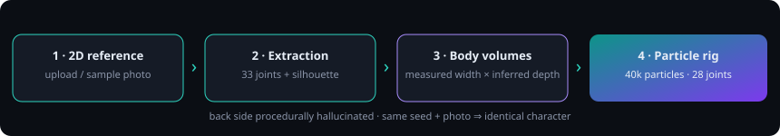

# Particle Person Arena

**Turn a 2D person photo into an interactive, rigged 3D particle character.**

Upload a photo (or use a bundled sample) → the app extracts the person's pose and
silhouette on-device → builds a volumetric body from capsules/ellipsoids →
fills it with up to 40,000 photo-colored particles bound to a 28-joint skeleton →
you orbit, pose, and animate the result in real time.



## Quickstart

```bash
npm install
npm run dev      # → http://localhost:5173
```

Production build (static, servable from anywhere):

```bash
npm run build    # → dist/
npm run preview
```

Tests (pure-engine, run in Node, no browser needed):

```bash
npm test
```

Headless visual check (requires `npm run dev` running):

```bash
node scripts/shot.mjs   # → shots/*.png
```

## How it works

```
2D reference → pose (33 joints) + person mask → body volumes → particles → rigged 3D
```

1. **Reference** — You provide a JPG/PNG (drag & drop, file picker, or bundled
   samples). Everything runs locally in the browser; the photo is never uploaded.
2. **Extraction** — MediaPipe Pose (loaded from CDN on demand) predicts 33 body
   joints, and a segmentation model cuts the person out of the background. Both are
   shown in the *Extracted person* panel next to the reference.
3. **3D body volumes** — Each body part (torso, head, upper/lower arms, hands +
   fingers, thighs, shanks, feet) becomes a volumetric capsule/ellipsoid whose
   width profile is **measured from your silhouette** by marching perpendicular
   rays through the person mask, clamped by anthropometric priors.
4. **Depth inference (deterministic & procedural)** — A photo has no back side, so:
   - joint depth uses the pose model's *relative* z (small effect: limb lean),
   - body thickness is procedural: depth radius ≈ width radius × a per-part
     flatness factor (elliptical cross-sections),
   - the hidden back is **hallucinated, not reconstructed**: particles fill the
     whole volume and reuse mirrored front colors, darkened with depth.
   
   The same seed + photo always builds the identical character (see `⚄ Shuffle`).
5. **Particles** — Up to 40,000 particles sampled *through the volume* (42% shell,
   58% interior), colored from the photo with bilinear sampling, shaded by depth.
6. **Rig & play** — Particles are bound to a 28-joint forward-kinematics skeleton,
   so joint sliders and animation presets (idle / wave / walk / dance / spin)
   deform the whole volume coherently from any camera angle.

### Graceful degradation

| Situation | Behavior |
|---|---|
| Pose found + mask | Full pipeline (best quality) |
| No pose, mask found | Neutral-stance body fitted to the silhouette |
| Models unreachable (offline) | Procedural body fitted to the photo framing, still photo-colored |
| No photo at all | Hologram mannequin demo (instant, offline) |
| Cropped bodies (e.g. selfies) | Missing parts are skipped, sliders for them disabled |

## Controls

- **Camera & view** — orbit/zoom/pan, auto-rotate turntable, rig-skeleton overlay,
  floor grid, frame/reset camera, PNG snapshot.
- **Particles** — density (2k–40k), size, scatter/explode, body-depth scale
  (flatten to “cardboard” or exaggerate the volume), color modes
  (Original / Vivid / Depth-heat / Body-parts).
- **Animation** — 6 presets + motion strength + pause. The wave preset adapts to
  the photo's rest arm angle.
- **Joints** — 18 sliders across arms / legs / head & torso / whole body,
  applied on top of any animation.

## Project structure

```
├── index.html            # app shell: header, pipeline panel, 3D stage, controls
├── public/samples/       # bundled demo photos (AI-generated, full-body)
├── src/
│   ├── body.js           # PURE engine: skeleton, volumes, particles, rig, anims
│   ├── ml.js             # MediaPipe pose + segmentation (CDN, on demand)
│   ├── viewer.js         # Three.js stage: points shader, skeleton, floor, camera
│   ├── main.js           # orchestration: intake → pipeline → loop → UI
│   └── styles.css        # dark studio theme
├── test/run.mjs          # Node tests: synthetic pose/mask/photo → build → rig → anims
└── scripts/shot.mjs      # headless-Chrome visual verification
```

`src/body.js` is deliberately dependency-free (no DOM, no WebGL) so the entire
transformation is unit-testable in Node with synthetic data.

## Tips for best results

Full body in frame · facing the camera · arms slightly away from the torso ·
plain, contrasting background · even lighting. Try the **Depth** color mode while
orbiting to feel the inferred volume.

## Limitations

- The back of the person is a plausible guess, not captured data.
- Loose clothing and occlusions widen the measured volumes; heavy occlusion
  degrades gracefully rather than failing.
- Joint rotations are world-axis approximations — great for play, not biomechanics.
- First run downloads ML models (~15–25 MB) from jsDelivr; afterwards the
  pipeline also works from cache where the browser allows it.
